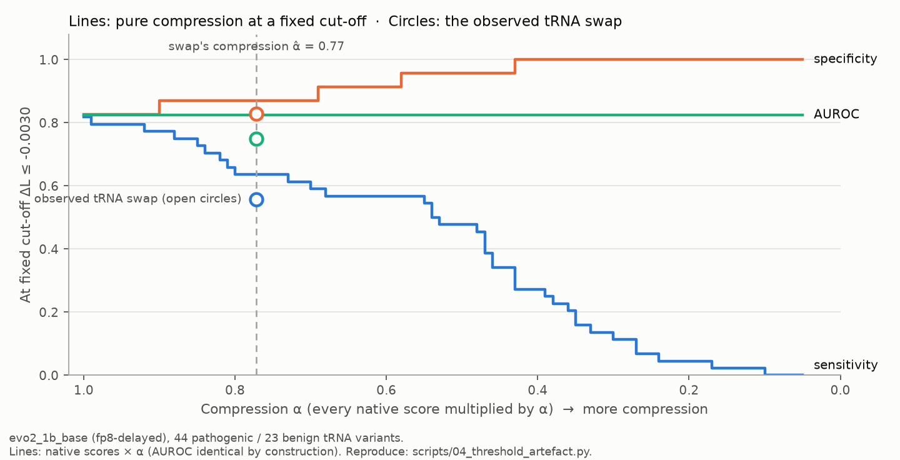
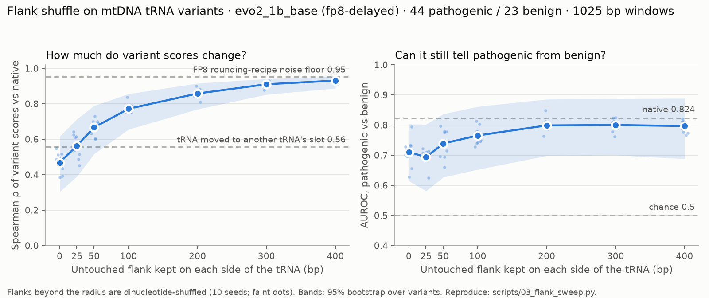

# Findings log

The running results log. Each entry records the date, the model checkpoint, the
command that produced the number, and the number with its confidence interval.

## 2026-10-04: v0.3 Arm 1, within-gene discrimination on protein-coding variants

Pre-declared in `docs/plan-v0.3-within-gene.md` (committed 96cb968 before
running). **Model: Evo 2 `evo2_1b_base` (1B), shipped FP8 recipe. Strict
labels; scores from the M3 baseline, no new scoring.** Reproduce:
`python scripts/06_within_gene.py --arm 1`. Intervals: 2,000 cluster-bootstrap
resamples over genes.

241 protein-coding variants (48 pathogenic) in
13 genes, all of which have both classes: **893
within-gene pairs** (largest: MT-ND1 264, MT-ATP6 225, MT-ND5 138).

| Score | AUROC |
|---|---|
| Model, whole set | 0.914 [0.853, 0.965] |
| Gene prior, leave-one-variant-out (ignores the variant) | 0.542 [0.279, 0.629] |
| Gene prior, in-sample (upper bound) | 0.697 [0.598, 0.759] |
| **Model, within-gene pairs only** | **0.934 [0.847, 0.978]** |

Dropping any one gene changes the within-gene AUROC by
-0.012 to +0.018.

**Pre-declared verdict: the model separates pathogenic from benign variants within the same protein-coding gene.** Here gene identity cannot explain the
result: the gene prior is weak (at most 0.697
even when it sees each variant's own label), and the model does as well within
genes as across them. Whatever limits the tRNA analyses, on protein-coding
variants `evo2_1b_base` is reading the variant.

No context control was run on these variants (the genes are longer than the
scoring window). Single scoring run.

## 2026-10-04: v0.2 analyses B and A (pre-declared)

Both analyses follow `docs/plan-v0.2-threshold-and-gene.md`, committed before
either was run (draft in d685ed8, amendments in d76533a; the amendments are
listed at the top of the plan). Decision rules are applied in code. No GPU:
both work on the committed per-variant scores. **Model: Evo 2 `evo2_1b_base`
(1B), shipped FP8 recipe, 67 tRNA variants (44 pathogenic, 23 benign) in 20
genes. Single scoring run.**

### B: does gene identity explain the native AUROC?

Reproduce: `python scripts/05_gene_confound.py` → `results/gene_confound.*`.
Intervals here are from 2,000 **cluster-bootstrap resamples over genes**
(13 MT-TL1 variants are not 13 independent facts), so they are wider than the
variant-level intervals elsewhere: native AUROC is 0.824 [0.724, 0.918] on
this basis.

| | AUROC |
|---|---|
| Model (−ΔL) | 0.824 [0.724, 0.918] |
| **B1** Gene prior, leave-one-variant-out (ignores the variant; biased low) | **0.627 [0.306, 0.802]** |
| **B1** Gene prior, in-sample (uses the variant's own label; biased high) | 0.901 [0.770, 0.969] |
| **B2** Model, within-gene pairs only (45 pairs) | 0.867 [0.704, 0.938] |
| **B3** Model, MT-TL1 removed | 0.776 [0.704, 0.878] |

- **B1 verdict (pre-declared, 0.60–0.75 band): gene identity is a substantial
  part of the native AUROC.** A score that never looks at the variant, only at
  which tRNA it is in, reaches between 0.627 and 0.901. The model's 0.824 sits
  inside that range.
- **B2 verdict: this dataset cannot separate gene identity from variant
  effect.** Only 45 of the 1,012 pathogenic–benign pairs share a gene, 25 of
  them in MT-TS1 (fewer than the pre-declared 100). On those 45 the model
  ranks pathogenic above benign 87% of the time, which is encouraging but
  descriptive only.
- **B3:** dropping any one gene changes AUROC by −0.049 to +0.034. MT-TL1
  (13 pathogenic, 0 benign) is the most influential at −0.0485, just under
  the pre-declared 0.05 threshold.
- **B4 (underpowered, as predicted):** scored on within-gene pairs only, every
  control's AUROC drop has an interval that includes zero (tRNA swap 0.044
  [−0.071, 0.182]; flank shuffle r = 0: 0.111 [−0.021, 0.417]). No CDI
  conclusions are drawn from these.
- **B5 (familiarity):** among all 228 benign variants, ΔL correlates with
  population allele frequency at Spearman 0.109 [−0.022, 0.240]; among the 23
  tRNA benign variants, −0.245 [−0.618, 0.225]. No clear familiarity signal,
  but this is a weak check (median benign allele frequency is 0.5%).

### A: is the published collapse a threshold artefact?

Reproduce: `python scripts/04_threshold_artefact.py` →
`results/threshold_artefact.*`.

**A0.** Multiplying every score by α > 0 leaves AUROC exactly unchanged
(asserted for 106 values of α) but moves scores across any cut-off fixed in
absolute units. So a uniform shrinkage of scores toward zero can collapse
sensitivity with discrimination untouched, by construction.

**A2: how much did the tRNA swap compress scores?** α̂ = 0.772 [0.552, 0.922]
(median |ΔL| ratio) or 0.744 [0.517, 0.892] (fit through the origin). A pure
scale change explains only part of what the swap did: R² of the fit is 0.49
[0.15, 0.71], consistent with per-variant Spearman 0.56. The classes compress
differently: |ΔL| shrinks to 0.65 of native for pathogenic variants but only
0.89 for benign. (The plan's "~0.64 and ~0.54" came from medians of signed
ΔL; benign ΔL straddles zero, so the signed and absolute ratios differ.)
Differential compression is a change in ranking, not just scale.

**A3: the decomposition**, at the native-Youden cut-off ΔL ≤ −0.0030:

| | Sensitivity | Specificity | AUROC |
|---|---|---|---|
| Native | 0.818 | 0.826 | 0.824 |
| Pure-compression null (native × α̂, either estimate) | 0.636 | 0.870 | 0.824 (identical by construction) |
| Observed tRNA swap | 0.557 | 0.828 | 0.750 |

- Share of the sensitivity drop that pure compression reproduces:
  **0.697 [0.23, 1.15]** (same with both α̂ estimates).
- Residual ranking loss: AUROC drop 0.074 [−0.030, 0.162], not significant.
- **Verdict (pre-declared rule: ≥ 0.70 and AUROC drop not significant →
  threshold artefact; < 0.40 → hypothesis wrong; between → indeterminate):
  indeterminate at this sample size.** The share falls just under 0.70.
  Sensitivity moves in steps of 1/44 = 0.023, so one more pathogenic variant
  crossing the cut-off would have given 0.78; the rule is applied as written.
- **Evidence against pure compression:** the null predicts specificity rises
  (0.826 → 0.870), because benign scores also move away from the cut-off.
  Under the real swap specificity stayed at 0.828.

**A4: rank-preserving surrogate** (the swap's score values, assigned in native
order). At the paper's cut-off the surrogate reproduces the swap's sensitivity
almost exactly (0.160 vs 0.159). At the native-Youden cut-off it reproduces
most of the drop (0.592 vs 0.557) but not the specificity (0.895 vs 0.828).
So the change in the score *distribution* accounts for most of the
sensitivity loss; reordering accounts for the rest and for specificity
staying flat.

**A5: simulation of the paper's operating point** (synthetic scores; not the
paper's data and not a reproduction). Two Gaussians calibrated to the paper's
native 65.8% sensitivity and 78.5% specificity at a Youden-optimal cut-off
ΔL ≤ −0.0081, with this repo's pathogenic SD as the free scale. Compressing
every score by α = 0.42 (0.27–0.59 for half to double the scale) takes
sensitivity to the paper's 5.1% with AUROC unchanged (0.791). Specificity
rises, as the paper reports, but to ~100% rather than 93.8%. Pure compression
is therefore enough to produce a collapse of that size and shape, and
overshoots the specificity rise, which is consistent with compression plus
some reordering.

### What A and B mean together

- The repo's headline AUROC is partly a statement about **which tRNA** a
  variant is in. A variant-blind gene prior gets within reach of the model,
  and the data cannot tell how much of the model's signal is within-gene.
- Under the tRNA swap, about 70% of the fixed-threshold sensitivity loss is
  what pure score compression produces, but this falls just short of the
  pre-declared bar, compression alone does not explain specificity staying
  flat, and pathogenic scores shrink more than benign ones. The honest summary
  is that compression is a large part of the mechanism, not all of it.
- None of this says the source paper is wrong. It measured a real effect at a
  real operating point; this shows one mechanism that produces its pattern.

## 2026-10-04: wider windows (4,097 bp)

**Model: Evo 2 `evo2_1b_base` (1B). Single run per configuration.** The
1,025 bp windows cap the flank sweep at r = 400 bp, so the baseline and sweep
were repeated with 4,097 bp windows (radii up to 1,900 bp). Reproduce:
`python scripts/01_baseline.py --window 4097` (with `--precision fp8-current`
for the second recipe) and
`python scripts/03_flank_sweep.py --window 4097 --radii 0,50,100,250,500,1000,1500,1900`
(~3.5 h on the GPU); the comparison below is
`python scripts/compare_runs.py results/baseline_fp8-delayed_w4097.csv results/baseline_fp8-current_w4097.csv`.

**Rounding noise is four times worse at 4,097 bp.** The variant's effect is
averaged over four times as many positions, so median |ΔL| falls from 0.0028
to 0.00075, while FP8 rounding noise does not shrink with it:

| | 1,025 bp | 4,097 bp |
|---|---|---|
| Spearman of ΔL between the two FP8 recipes, tRNA | 0.95 | **0.84** |
| Same sign between recipes, all variants | 90.1% | 86.0% |
| Native AUROC, all variants (shipped / current-scaling recipe) | 0.856 / 0.849 | 0.815 / 0.834 |
| Native AUROC, tRNA (shipped / current-scaling) | 0.824 / 0.813 | 0.779 / 0.760 |
| AUROC difference between recipes, protein-coding | 0.009 [−0.012, 0.029] | **−0.031 [−0.063, −0.004]** |

At 4,097 bp the rounding recipe alone changes protein-coding AUROC by a
detectable amount. Longer windows give this model no better discrimination
(all-variant AUROC 0.815–0.834 against 0.849–0.856 at 1,025 bp) and noisier
scores; per-variant ΔL at the two window sizes correlates at Spearman 0.86.
Results at 1,025 bp remain the headline.

**Flank sweep at 4,097 bp** (shipped recipe, native tRNA AUROC 0.779):

| Untouched flank *r* | Spearman of ΔL vs native | AUROC | CDI |
|---|---|---|---|
| 0 bp | 0.49 [0.30, 0.64] | 0.733 [0.637, 0.830] | 0.16 [−0.36, 0.48] |
| 50 bp | 0.63 [0.45, 0.76] | 0.742 [0.635, 0.845] | 0.13 [−0.36, 0.45] |
| 100 bp | 0.68 [0.50, 0.81] | 0.752 [0.642, 0.851] | 0.09 [−0.38, 0.41] |
| 250 bp | 0.70 [0.54, 0.82] | 0.782 [0.679, 0.868] | −0.01 [−0.52, 0.28] |
| 500 bp | 0.80 [0.65, 0.90] | 0.792 [0.689, 0.878] | −0.05 [−0.46, 0.20] |
| 1,000 bp | 0.79 [0.64, 0.90] | 0.800 [0.699, 0.887] | −0.08 [−0.49, 0.15] |
| 1,500 bp | 0.86 [0.78, 0.91] | 0.775 [0.669, 0.863] | 0.01 [−0.29, 0.21] |
| 1,900 bp | 0.86 [0.77, 0.91] | 0.773 [0.670, 0.863] | 0.02 [−0.28, 0.22] |

Read against the 0.84 noise floor, **shuffling context more than ~500 bp from
the tRNA has no detectable effect** on per-variant scores, and none on AUROC
beyond ~250 bp. This agrees with the 1,025 bp sweep: what the model uses is
local. The CDI intervals here are much wider than at 1,025 bp because the
native AUROC is closer to chance and the scores are noisier, so this run
cannot say how much signal the full scramble removes.

## 2026-10-04: flank-shuffle sweep (M5)

**Model: Evo 2 `evo2_1b_base` (1B), Evo 2's shipped FP8 recipe. 67 tRNA
variants (44 pathogenic, 23 benign), 1,025 bp windows, 10 shuffle seeds per
radius.**

Each tRNA is held fixed. Everything more than *r* bp outside it, on either
side, is replaced by a dinucleotide-preserving (Altschul–Erikson) shuffle of
itself. At r = 0 all context is scrambled; at r = 400 only the outer
~40–80 bp at each end of the window are. Base composition and dinucleotide
counts never change, so only the *order* of the context is tested.

Reproduce: `python scripts/03_flank_sweep.py` (GPU, ~40 min) or `--from-csv`
(seconds), then `python scripts/plot_flank_sweep.py`.

| Untouched flank *r* | Spearman of ΔL vs native | AUROC (native 0.824) | CDI | Seed SD (ρ / AUROC) |
|---|---|---|---|---|
| 0 bp | 0.47 [0.30, 0.62] | 0.710 [0.615, 0.803] | **0.35 [0.01, 0.63]** | 0.054 / 0.045 |
| 25 bp | 0.56 [0.39, 0.71] | 0.694 [0.581, 0.802] | 0.40 [0.10, 0.72] | 0.063 / 0.027 |
| 50 bp | 0.67 [0.52, 0.79] | 0.739 [0.627, 0.837] | 0.26 [0.01, 0.53] | 0.043 / 0.046 |
| 100 bp | 0.77 [0.66, 0.86] | 0.765 [0.652, 0.861] | 0.18 [−0.12, 0.44] | 0.028 / 0.029 |
| 200 bp | 0.86 [0.77, 0.92] | 0.799 [0.698, 0.886] | 0.08 [−0.20, 0.27] | 0.026 / 0.022 |
| 300 bp | 0.91 [0.85, 0.94] | 0.800 [0.700, 0.887] | 0.07 [−0.12, 0.23] | 0.014 / 0.020 |
| 400 bp | 0.93 [0.89, 0.95] | 0.797 [0.688, 0.888] | 0.09 [−0.06, 0.22] | 0.013 / 0.019 |

Each statistic is the mean over the 10 seeds; intervals are 95% from 2,000
label-stratified bootstrap resamples of variants (paired with native); seed
SD is the spread across seeds on all variants.

What this shows:

1. **Scrambling all context costs about a third of the above-chance
   signal.** At r = 0, AUROC falls to 0.710 and CDI is 0.35, the only
   setting in this repo so far whose CDI interval excludes zero (and only
   just: lower bound 0.006). Scrambling the context removes more signal
   than moving the tRNA to another tRNA's real neighbourhood (M4: AUROC
   0.750, CDI 0.23).
2. **The model's dependence on context is local.** Score stability rises
   steadily with the untouched radius and reaches 0.93 at 400 bp, close to
   the 0.95 floor set by FP8 rounding noise alone. Discrimination recovers
   faster: from r = 200 bp on, AUROC is ~0.80 and CDI intervals include
   zero.
3. **Seeds agree.** Across 10 shuffles, AUROC varies by SD ≤ 0.046 at any
   radius, so the variant sample (n = 67), not the shuffle, dominates the
   uncertainty.
4. **Even the gene alone keeps most of the signal.** At r = 0, AUROC 0.710 is
   still well above 0.5: most of the discrimination survives with nothing
   but the tRNA's own sequence in its true order.

### Robustness: FP8 recipe

All three controls were re-run with Transformer Engine's current-scaling FP8
recipe (`--precision fp8-current`; results files with that suffix). The
conclusions do not change:

| | Shipped recipe (headline) | Current scaling |
|---|---|---|
| Native tRNA AUROC | 0.824 | 0.813 |
| tRNA swap: AUROC under control / CDI | 0.750 / 0.23 [−0.12, 0.45] | 0.747 / 0.21 [−0.12, 0.44] |
| Window rotation: CDI | 0.09 [−0.05, 0.23] | 0.08 [−0.06, 0.20] |
| Flank shuffle r = 0: AUROC / CDI | 0.710 / 0.35 [0.01, 0.63] | 0.701 / 0.36 [0.03, 0.63] |
| Flank shuffle r = 400: Spearman | 0.93 | 0.94 |

Provenance note: `results/flank_sweep.json` was scored by code at commit
e25d6d0; the run read HEAD only when it finished and first stamped 774e095.
The stamp was corrected by hand. The scoring code for default arguments is
the same at both commits.

## 2026-10-04: context-swap controls on tRNA variants (M4)

**Model: Evo 2 `evo2_1b_base` (1B), Evo 2's shipped FP8 recipe. 67 tRNA
variants (44 pathogenic, 23 benign). Single scoring run per control.**

Two versions of the control, both keeping every tRNA's own bases
byte-identical (asserted on every perturbed sequence):

- **tRNA swap** (the source paper's design): every tRNA moves into the slot
  of the tRNA *k* places along the chromosome, carrying its own sequence;
  all 19 shifts. Overlapping tRNAs (MT-TI+MT-TQ, MT-TC+MT-TY) move as one unit.
- **Window rotation:** each 1,025 bp scoring window is rotated by 64, 128, …
  bp, skipping offsets that would cut the tRNA; 13 offsets.

The unperturbed setting reproduces the M3 baseline scores exactly.

Reproduce: `python scripts/02_permutation.py --control trna-swap` (GPU,
~10 min), or `--from-csv` to recompute every number below from
`results/permutation_*.csv` in seconds without a GPU.

| | tRNA swap | Window rotation |
|---|---|---|
| AUROC native | 0.824 [0.713, 0.915] | 0.824 [0.713, 0.915] |
| AUROC under control (mean over settings) | 0.750 [0.661, 0.826] | 0.793 [0.692, 0.877] |
| Range across settings | 0.657 – 0.835 | 0.745 – 0.843 |
| **AUROC drop** | **0.074 [−0.030, 0.162]** | 0.031 [−0.015, 0.072] |
| **CDI** | **0.23 [−0.12, 0.45]** | 0.09 [−0.05, 0.23] |
| Spearman of ΔL, native vs control (mean) | **0.56** (0.40 – 0.71) | 0.90 (0.77 – 0.96) |
| Sensitivity / specificity at native-Youden cut-off (ΔL ≤ −0.0030) | 0.82 / 0.83 → **0.56 / 0.83** | 0.82 / 0.83 → 0.69 / 0.80 |
| Sensitivity / specificity at the paper's cut-off (ΔL ≤ −0.0081) | 0.23 / 1.00 → 0.16 / 1.00 | 0.23 / 1.00 → 0.22 / 1.00 |
| Median ΔL, pathogenic | −0.0056 → −0.0036 | −0.0056 → −0.0048 |
| Median ΔL, benign | −0.0013 → −0.0007 | −0.0013 → −0.0013 |

95% intervals: 2,000 label-stratified bootstrap resamples of variants, paired
across native and control.

What this shows:

1. **Moving a tRNA to another tRNA's address changes its variant scores a
   lot.** Per-variant Spearman falls to 0.56, far below the ~0.95 that
   changing only the FP8 recipe produces. Context is a large part of each
   individual score.
2. **But ranking survives better than the scores do.** AUROC falls from
   0.824 to 0.750, still well above chance, and the drop (0.074) has an
   interval that includes zero at this sample size. CDI is 0.23: on the
   point estimate, about a quarter of the above-chance signal depends on
   the tRNA's genomic address, but the data are also consistent with none
   and with nearly half.
3. **Threshold metrics exaggerate the effect.** Under the swap, effect sizes
   shrink for both classes (median pathogenic ΔL −0.0056 → −0.0036), so a
   cut-off fixed on native scores loses 26 points of sensitivity while
   specificity is unchanged. This is the mechanism suggested in the M2 entry
   for the paper's 65.8% → 5.1% collapse: a compressed score distribution
   crossing a fixed threshold, rather than (only) lost discrimination.
4. **Window rotation is a milder control** (Spearman 0.90, CDI 0.09). It
   keeps the same bases in the window and only rearranges them, so it tests
   sensitivity to arrangement and to an artificial junction, not to a
   genuinely different neighbourhood.

**Relation to the paper.** The direction is reproduced: moving tRNAs lowers
sensitivity at a fixed threshold. The magnitude is not: 0.82 → 0.56 here
against 0.658 → 0.051 in the paper, and specificity does not rise as it did
there. The differences in setup are large (model size unstated in the paper,
a different benign set, a different threshold and possibly a different
permutation), so this is not evidence the paper is wrong. It does show that,
for `evo2_1b_base` on this variant set, the tRNA signal is far from purely
contextual.

Limitations specific to this result:
- n = 67, with 23 benign. Intervals are wide; the AUROC drop is not
  significant.
- tRNA labels cluster by gene (MT-TL1 has 13 pathogenic, 0 benign). Part of
  the native AUROC may be the model telling genes apart rather than variants
  within them; this was not separated out.
- The swap leaves genes in reference-strand orientation. A minus-strand tRNA
  placed in a plus-strand neighbourhood is part of the perturbation.
- Single run per control; FP8-recipe sensitivity was checked for the
  baseline only.

## 2026-10-04: native baseline (M3)

**Model: Evo 2 `evo2_1b_base` (1B parameters), Evo 2's shipped FP8 recipe.**
1,025 bp windows centred on each variant (wrapping around the circular
chromosome). Pathogenicity score = −ΔL, where ΔL = mean log-likelihood of the
alt window minus that of the ref window. 95% intervals are from 2,000
label-stratified bootstrap resamples over variants.

Reproduce: `python scripts/01_baseline.py` (per-variant scores in
`results/baseline_fp8-delayed.csv`, metrics in `.json`). Run twice; the
per-variant scores were bit-identical.

| Region | Pathogenic / benign | AUROC | AUPRC (no-skill) |
|---|---|---|---|
| All | 94 / 228 | **0.856** [0.805, 0.903] | 0.760 [0.683, 0.836] (0.292) |
| tRNA | 44 / 23 | **0.824** [0.713, 0.915] | 0.910 [0.847, 0.960] (0.657) |
| Protein-coding | 48 / 193 | 0.914 [0.864, 0.955] | 0.776 [0.671, 0.877] (0.199) |
| rRNA | 2 / 12 | not interpretable (2 pathogenic) | |

The tRNA AUROC of 0.824 is the number the permutation control (M4) will be
measured against.

How to read this:

- **It is one model, one window size and one label set.** The paper reports an
  overall AUROC of 0.896 with an unstated checkpoint and a larger benign set
  (623, including ClinGen frequency data). The two numbers are not directly
  comparable.
- **The paper's threshold does not transfer.** At its cut-off (ΔL ≤ −0.0081),
  tRNA sensitivity here is 22.7% (specificity 100%), against the paper's 65.8%
  native. A fixed threshold depends on the model and the dataset, which is why
  this repo leads with AUROC.
- **tRNA AUPRC looks high because most tRNA variants in the set are pathogenic**
  (no-skill 0.657). Compare it with its no-skill value, not with 0.5.
- **Possible confound, not tested:** most ClinVar-benign mtDNA variants are
  common population polymorphisms. The model may partly score how *familiar*
  an allele is from training data rather than its effect on function.

### FP8 recipe sensitivity

Re-running with Transformer Engine's current-scaling FP8 recipe
(`--precision fp8-current`) gives overall AUROC 0.849 and tRNA 0.813.
`python scripts/compare_runs.py results/baseline_fp8-delayed.csv results/baseline_fp8-current.csv`:

| Region | Spearman of ΔL | Same sign | AUROC difference (paired bootstrap) |
|---|---|---|---|
| All | 0.944 | 90.1% | 0.007 [−0.013, 0.027] |
| tRNA | 0.953 | 92.5% | 0.011 [−0.035, 0.057] |
| Protein-coding | 0.942 | 88.8% | 0.009 [−0.012, 0.029] |

**The rounding recipe matters for single variants but not for AUROC.**
Per-variant scores move by a median of 31% of a typical |ΔL|, and 1 in 10
variants changes sign, but the AUROC difference is small and not significant.

**Consequence for the controls:** per-variant score stability (Spearman) under
a control has to be read against this ~0.94 floor. A control that leaves
Spearman near 0.94 has changed scores no more than switching FP8 recipes does.

## 2026-10-04: the labelled mtDNA set, and how it differs from the paper

`python scripts/fetch_data.py` builds 94 pathogenic (MITOMAP `Cfrm-[P]`/`Cfrm-[LP]`)
and 228 benign (ClinVar, 2+ stars) single-base chrM variants. Counts per region
are in `data/MANIFEST.md`. The tRNA subset, which the permutation control (M4)
targets, is small: **44 pathogenic, 23 benign**. Confidence intervals there will
be wide.

Compared with the benchmark this repo builds on (Mathur & Sachidanandam,
bioRxiv 2026.03.10.710786):

| | Paper | This repo |
|---|---|---|
| Pathogenic | MITOMAP confirmed, n = 130 | MITOMAP `Cfrm-[P]`/`[LP]`, SNVs only, n = 94 |
| Benign | ClinVar 2+ stars **plus ClinGen frequency data**, n = 623 | ClinVar 2+ stars only, n = 228 |
| tRNA pathogenic | 79 | 44 |
| Model | not stated for the mtDNA experiment | `evo2_1b_base` |

Three points from the paper's methods that M4 must take into account:

1. **The 65.8% to 5.1% collapse is sensitivity at a fixed threshold**
   (Youden-optimal ΔL = −0.0081), not AUROC, and specificity rose to 93.8%
   at the same time. That pattern fits a shift of the whole score
   distribution, which a fixed threshold detects but which need not reduce
   ranking (AUROC). The paper reports no AUROC after permutation, so this
   repo's AUROC-based CDI is a new measurement, not a reproduction. M4 will
   report both sensitivity at a threshold and AUROC.
2. **What "cyclic permutation" means.** The paper "cyclically permuted the
   positions of all mitochondrial tRNAs while leaving their internal sequences
   intact", which reads as moving tRNA genes between one another's positions.
   CLAUDE.md §5.1 describes rotating the sequence window instead. These are
   different perturbations; M4 must pick one, or run both, and say which.
3. The paper's window is 512 bp either side of the variant (1,025 bp).

## 2026-10-04: batch size changes Evo 2 1B scores more than a variant does

Model: `evo2_1b_base` (1B, FP8, RTX 4060 Laptop GPU). On 8 single-base mtDNA
variants (501 bp windows), changing batch size from 1 to 8 or 16 moved
per-sequence scores by up to 0.0033, against a median variant effect of
0.00087, and flipped 3 of 8 variant signs. All scoring in this repo therefore
uses batch size 1. Reproduce: `python scripts/check_batch_size.py`. Details:
`docs/model-choice.md`. Single run on 16 sequences.
