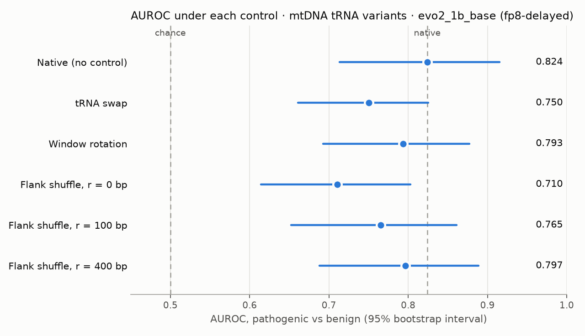

# Trust card: mtDNA tRNA variants · `evo2_1b_base (fp8-delayed)`

How much of this model's ability to separate pathogenic from benign variants depends on the sequence *around* the gene rather than the gene itself?

**Model:** Evo 2 `evo2_1b_base (fp8-delayed)`, 1B parameters. **Variants:** 44 pathogenic (MITOMAP confirmed) and 23 benign (ClinVar, 2+ stars) single-base variants in mitochondrial tRNA genes. **Score:** −ΔL over a 1025 bp window. **Intervals:** 95%, bootstrap over variants.

## Headline

- Native AUROC: **0.824 [0.713, 0.915]** (AUPRC 0.910 [0.847, 0.960], no-skill 0.657).
- **Pre-declared verdict: gene identity is a substantial part of the native AUROC.** A score that ignores the variant and uses only its gene's pathogenic fraction reaches 0.627 (leave-one-out) to 0.901 (in-sample); only 45 pathogenic–benign pairs share a gene, too few to separate gene identity from variant effect (`scripts/05_gene_confound.py`).
- Largest context dependence: **Flank shuffle, r = 0 bp**, CDI 0.35 [0.01, 0.63].
- Controls whose CDI interval excludes zero: Flank shuffle, r = 0 bp.
- Per-variant scores are context-sensitive: Spearman vs native falls to 0.47, against 0.95 from FP8 rounding alone.



## Controls

CDI = (AUROC_native − AUROC_control) / (AUROC_native − 0.5): the share of above-chance discrimination lost under the control. 0 = none, 1 = all.

| Control | What changes | AUROC | CDI | Spearman ΔL vs native |
|---|---|---|---|---|
| tRNA swap | each tRNA moved into another tRNA's slot (19 shifts) | 0.750 [0.661, 0.826] | 0.23 [-0.12, 0.45] | 0.56 |
| Window rotation | scoring window rotated, gene kept whole (13 offsets) | 0.793 [0.692, 0.877] | 0.09 [-0.05, 0.23] | 0.90 |
| Flank shuffle, r = 0 bp | all context dinucleotide-shuffled, gene kept | 0.710 [0.615, 0.803] | 0.35 [0.01, 0.63] | 0.47 |
| Flank shuffle, r = 100 bp | context shuffled beyond 100 bp of the gene | 0.765 [0.652, 0.861] | 0.18 [-0.12, 0.44] | 0.77 |
| Flank shuffle, r = 400 bp | context shuffled beyond 400 bp of the gene | 0.797 [0.688, 0.888] | 0.09 [-0.06, 0.22] | 0.93 |

Noise floor for Spearman: 0.95, the agreement between two FP8 rounding recipes with no control applied.

## At a fixed threshold

Sensitivity at a cut-off chosen on native scores (Youden), then held fixed:

- tRNA swap: 0.82 → 0.56
- Window rotation: 0.82 → 0.69

Threshold metrics fall further than AUROC. Under the tRNA swap, shrinking every native score toward zero (which leaves AUROC unchanged) reproduces 0.697 of the sensitivity drop; the pre-declared verdict is *indeterminate at this sample size* (`scripts/04_threshold_artefact.py`).

## Read with care

- Small sample: 44 pathogenic and 23 benign. Most intervals are wide.
- One checkpoint (the smallest Evo 2 model), one window size, one label set. Larger Evo 2 models were not tested.
- tRNA labels cluster by gene (MT-TL1: 13 pathogenic, 0 benign); every control result inherits the gene-identity caveat above.
- Benign variants are mostly common polymorphisms; the model may partly score allele familiarity.
- FP8 runs on an Ada GPU (RTX 4060 Laptop), not the Hopper GPU Evo 2 documents.
- This card describes model behaviour on a benchmark. It says nothing about clinical use.

## Reproduce

```bash
python scripts/fetch_data.py
python scripts/01_baseline.py
python scripts/02_permutation.py --control trna-swap
python scripts/02_permutation.py --control window-rotation
python scripts/03_flank_sweep.py
seqcontrol card
```

Scored at commits a1c271c, b1df6fb; data checksums in `data/MANIFEST.md`.
